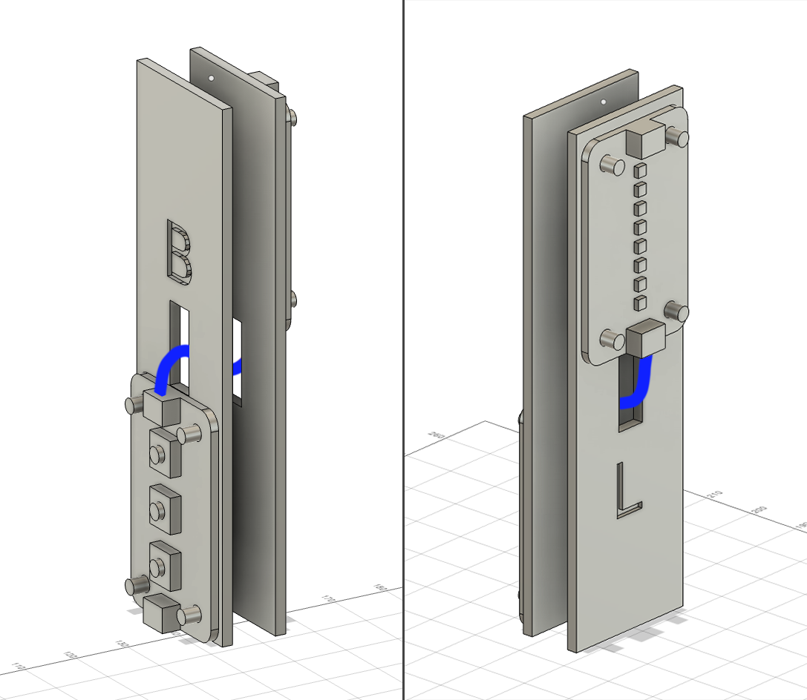
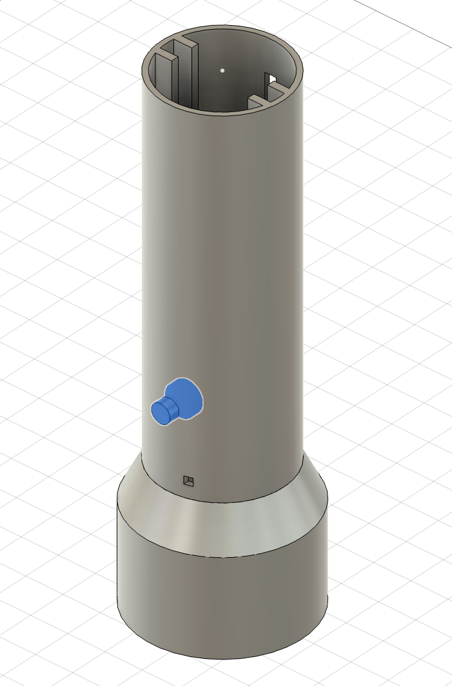
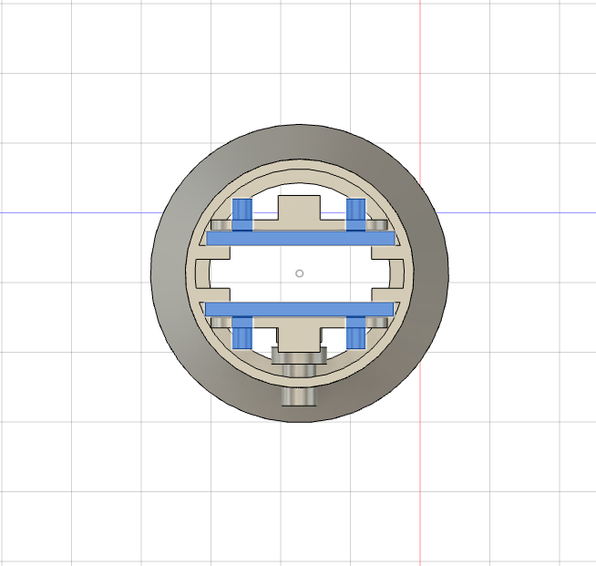
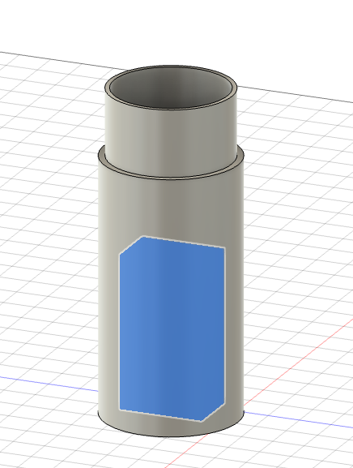
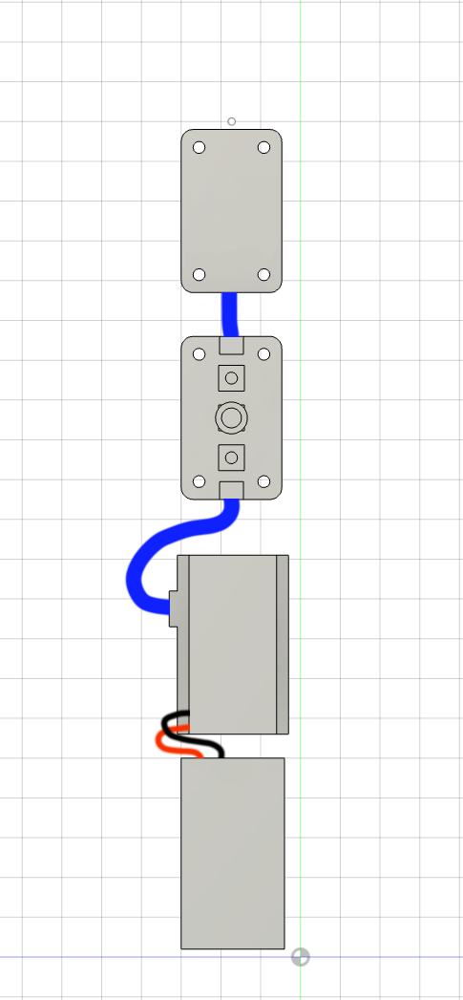
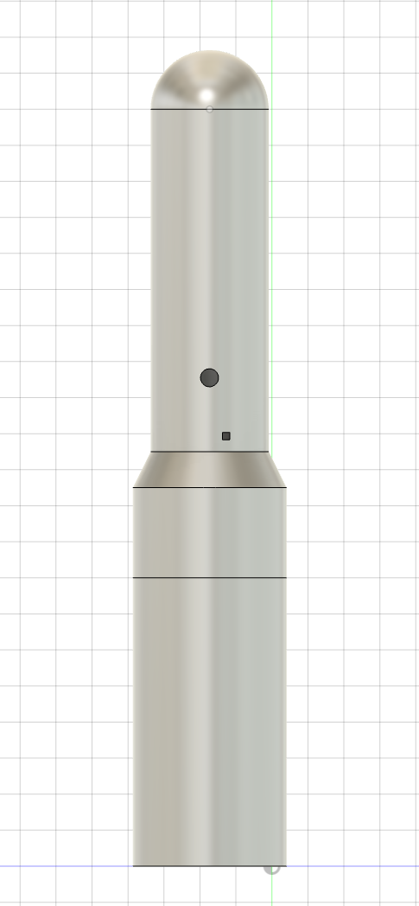

# Arduino-Android Neuralyzer 3D model
The 3D model for the neuralyzer is composed of the following parts, each one with the relative .stl print file:

- **Bottom enclosure**: the base of the model, contains the battery and the Arduino
- **Top enclosure**: the upper part of the model, contains the Modulino modules, and the trigger button
- **Button**: the trigger button, aligned with the central Modulino button
- **Top sphere**: the dome at the top of the model
- **Modulino beds**: internal support for the two Modulinos. They are marked with L for the LED Modulino, B for the buttons Modulino. They slide inside the top enclosure

## Print configuration

- Filament: PLA
- Layers height: 0.20 mm
- Infil: 25%
- Brim: optional
- Support: everywhere, organic. Only needed for the top enclosure.

## Asssembly

1. Place each Modulino to the relative supporting bed: the one marked with L for the LED one, B for the button one
2. Connect the two Modulinos together with their ribbon cable, making it pass through the supporting beds central hole, like in the following picture:

3. Place the button in the top enclosure:

4. Connect an extra ribbon cable at the bottom of the buttons Modulino
5. Slide the two supporting beds inside the top enclosure, from the top

6. Connect the Arduino base with the ribbon cable you previously connected with the buttons Modulino, coming from the top enclosure
7. Connect the 9V battery connector cable to the GND and VIN pins in the Arduino and to the battery
8. Slide the 9V battery in the bottom enclosure with the Arduino on top

9. Slide the bottom enclosure inside the top enclosure and add the dome on top
10. Start erasing memories! 😎

